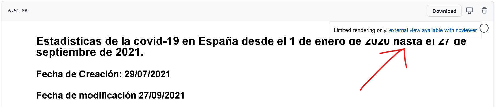

# Estadísticas de la Covid 19 en España
En el presente documento se analizan los datos oficiales de la Covid-19 en España por edades, por fecha y por provincias.

Hacer click en **Datos de la Covid-19.ipynb** para ver el archivo y para visualizar las gráficas y mapas correctamente seleccionar la opción de abrir con nbviwer tal como se muestra en la imagen de abajo.

